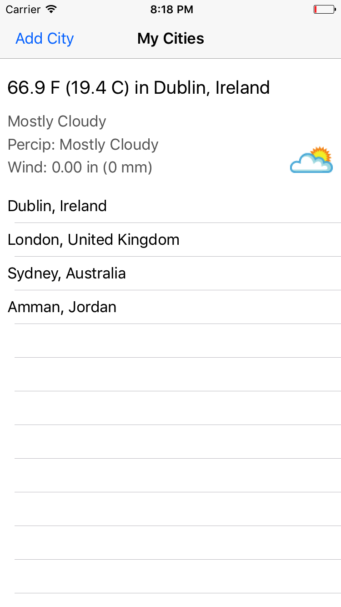
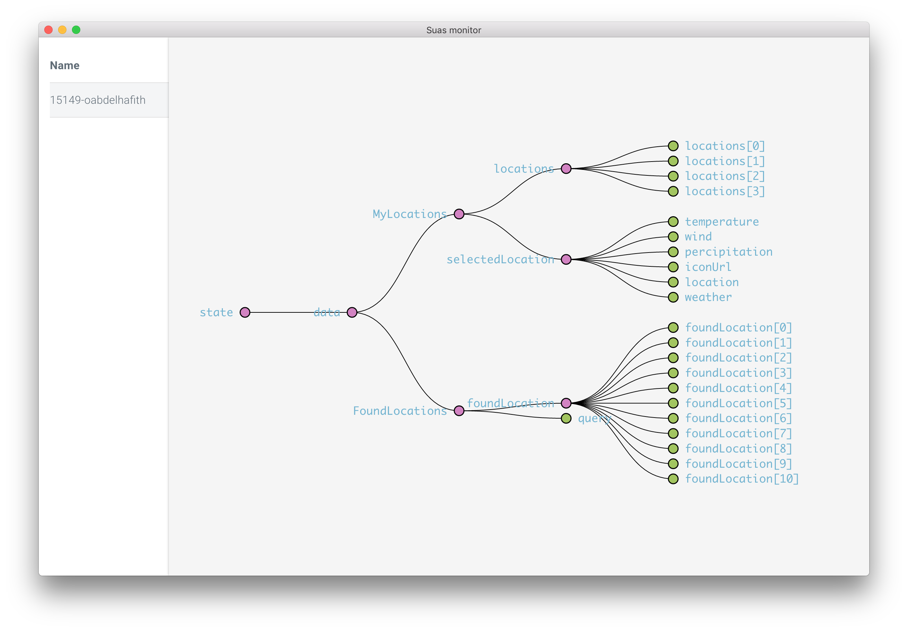

# Suas Weather App Sample



Weather sample app built using [Suas-iOS](https://github.com/zendesk/Suas-iOS). It also uses the [Monitor middleware](https://github.com/zendesk/Suas-Monitor-Middleware) to send the state to [Suas Monitor](https://travis-ci.com/zendesk/Suas-Monitor).

Requirements:
- Xcode 9.0
- Swift 4 and up

Install:

```
carthage update --platform ios
```

Open the sample app and run it.

## Using Suas monitor


- Download Suas monitor and open it
- Run the app and select the device from the list of devices